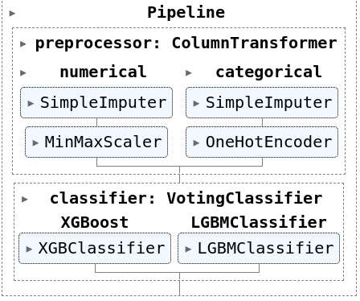

# Solução 2º Lugar

Os nossos dados possuíam três características bem marcantes:

- a presença de valores missing
- o desbalanceamento de classes
- o alto número de variáveis.

Como o sistema de submissão da competição não visava nenhuma restrição do tempo de processamento dos dados, não levei em consideração tempo de treinamento nem performance da solução final de inferência.

Dentre todo o conjunto de variáveis que tínhamos disponíveis nem todas contribuíam para o modelo, considerando os modelos que eu estava utilizando. O feature engineering de scores intermediários pode ser encontrado no histórico de commits desse repositório, e contemplavam algumas abordagens mais elaboradas. Porém, aqui vou descrever apenas a solução final, que nesse quesito houve pouquíssimo ajuste.

Vale ressaltar que você encontra um arquivo chamado `data_dict.md` onde está registrado todas as minhas dúvidas sobre as variáveis e ideias que tive de como tratar alguns casos.

# Pipeline

Como em toda competição do kaggle, uma abordagem inicial é você ter um fluxo onde seja possível rapidamente gerar uma submissão e sentir como está o seu score no board público. Foi isso que eu fiz e surpreendentemente foi o que surtiu maior efeito ao longo de toda a competição.

No pré-processamento dos valores missing, utilizei apenas imputes simples, _de mais frequentes_ para variáveis categóricas e de _mediana_ para variáveis numéricas.

Em seguida, as variáveis numéricas sofreram um scaling e as categóricas foram imputadas com o **OrdinalEncoder** (diferente da imagem que foi quando tentei com o _OneHotEncoder_). O que também me deu uma surpresa por que em alguns modelos isso pode configurar um nível de importância entre as categorias das variáveis (1 < 2 < 3...), mas que aqui com modelos tree-based não foi um problema.

Por fim, utilizei um embedding com Xgboost e LightGBM com uma estratégia de votação. Acho que aqui vale uma menção honrosa ao **HistGradientBoostingClassifier** que é incrivelmente rápido de treinar e que me possibilitou iterar muito sobre a estratégia e subir o score para o topo do Leaderboard.

# Variáveis

Ao longo de toda a competição eu fui analisando qual variável contribuia ou não o modelo, acho que aqui realmente faltou automatizar o processo. Mas basicamente o que tentei remover do meu dataset foram:

- Variáveis com praticamente variância 0
- Variáveis que possuíam o mesmo significado
- Variáveis com alto grau de missing values
- Variáveis que apareciam apenas caso o paciente respondesse algumas respostas específicas no questionário
  - _Aqui eu não removi todas nesse sentido_

De variáveis externas, as que eu utilizei foram:

- PIB
- Latitude e Longitude dos municípios
- Região do Brasil

O processo de tratamento para incorporação dessas variáveis na nossa base pode ser encontrado tanto no notebook `ibge_get.ipynb` quanto no `pipeline_real.py` (onde temos todo o pipeline de treinamento e geração de métricas e arquivo de submissão).

Tentei densidade demográfica, mas não surtiu efeito.

Você pode encontrar todas as variáveis que eu utilizei no `params.yaml` e no `data_dict.md` possui muitas observações sobre as mesmas.

# Modelos

Do ponto de vista de modelos utilizados, muitos foram testados ao longo da competição, e alguns parâmetros foram investigados praticamente de forma manual já que depois de "perder" dois dias com um GridSearch com o HistGradientBoostingClassifier, preferi testar alguns parâmetros de uma forma menos custosa. Tentei também o embedding com mais modelos e com mais modelos diferentes (regressão logística por exemplo), mas o score só piorou, mesmo adicionando um peso para cada votação.

Para driblar o desbalanceamento, eu ajustei um parâmetro de `class_weight` dos modelos. Também cheguei a testar algumas estratégias de OverSampling como:

- SMOTE
- SMOTEEN
- ADASYN
- RandomOverSampling

Mas também nenhuma foi interessante, na realidade algumas delas levaram os modelos a overfitarem.

# Rodando o pipe

No repo você encontra as várias EDAs que fui fazendo ao longo do caminho e um notebook chamado `testing_pipe.ipynb`. É nele que eu rodo essa nossa classe de treino do `pipeline_real.py`.

# Conclusões

Acho que vale pontuar aqui que esses dados são um prato cheio para problemas éticos nos modelos criados. Um exemplo é que temos variáveis de cor de pele e etnia, e isso faz com que seja necessário uma análise para entender se caso uma pessoa seja negra ou indígena o modelo não esteja priorizando uma categoria específica do target. Ou ainda, no caso de regiões mais pobres ou ainda de indivíduas com ocupações de baixa renda.

Acredito que em modelos que de fato vão para produção, todos esses aspectos precisam ser avaliados para não gerar viéses danosos a população.

Agradeço a organização por esse projeto, e pela possibilidade de trabalhar com esse tipo de dado que pode gerar um impacto muito grande na sociedade.
